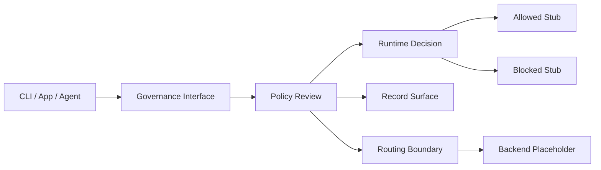

# ETERNAL FRAME FATE V3 (Public Use)

**Status:** public reference skeleton.

I designed **Eternal Frame Fate V3** as a governed AI runtime architecture. This repository contains the public interface layer: documentation, configuration contracts, policy examples, an API shape, and a safe CLI stub.

It demonstrates a high-level architecture for:

- persona lanes
- proof gates
- runtime switching
- advisory sub-agents
- audit and receipt surfaces
- governance boundaries
- public/private separation

This repository preserves the **shape and intent** of the architecture, not the private implementation.

## Purpose

LLM-powered tools need a clear control layer around requests, policies, execution choices, and records. EFFV3 Public Use demonstrates that layer as a reference architecture.

It is useful for thinking about:

- policy validation before execution
- controlled routing boundaries
- output treatment
- record requirements
- token and cost controls
- integration points for CLI or API usage

## Architecture overview



## Repository map

| Path | Purpose |
|---|---|
| `BLUEPRINT_PROMPT.md` | Prompt that describes the sanitized scaffold. |
| `generate_blueprint.sh` | Generates the public scaffold locally. |
| `docs/architecture.md` | System overview and governance flow. |
| `docs/config.md` | Configuration reference. |
| `config/config.schema.yaml` | Public config schema. |
| `config/config.example.yaml` | Example configuration. |
| `policies/` | Example policy files. |
| `cli/effv3_stub.py` | CLI stub that validates config and stops before live execution. |
| `api/openapi.yaml` | Public API contract shape. |
| `examples/` | Example request and response payloads. |
| `SECURITY.md` | Public boundary rules. |
| `CONTRIBUTING.md` | Contribution scope. |

## Quick start

Generate the public scaffold:

```bash
bash generate_blueprint.sh
```

Run the CLI stub:

```bash
python3 cli/effv3_stub.py --config config/config.example.yaml --prompt "summarize this document"
```

Expected behavior:

```text
[EFFV3 Public Stub] Configuration parsed.
[EFFV3 Public Stub] Request received for review.
[EFFV3 Public Stub] Live execution not included in this public skeleton.
```

## License

MIT license for the public skeleton and examples.
